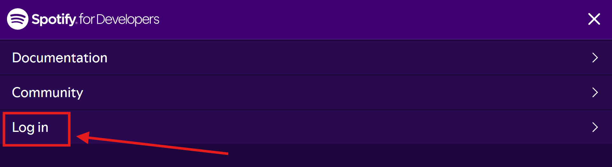
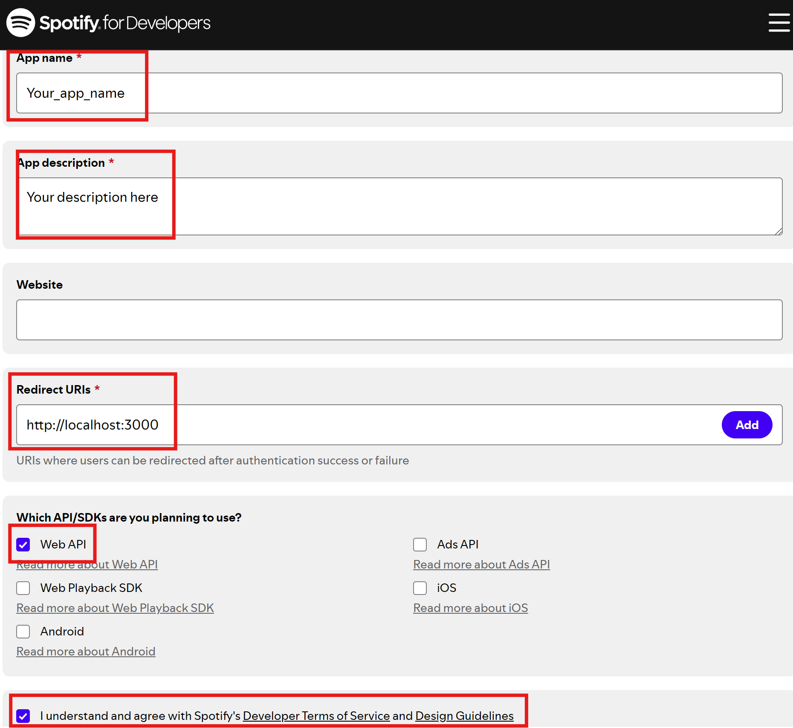
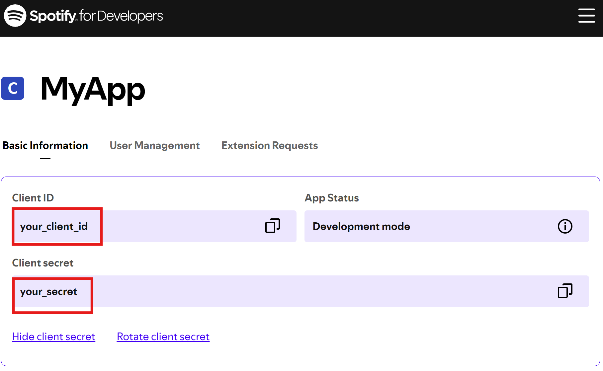
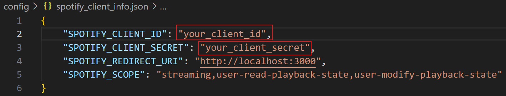

# Praximedes
Elevate your vibe with seamless control over

- 💡 LED lights (HappyLighting) 
- 🎧 Synced music playback (Spotify)
- 🗣️ Intuituve voice commands 

All of the above, in Python! 

## 🚀 Getting Started:
1. **Clone repository**
```bash
git clone https://github.com/tapiaer22/Praximedes.git
```
<br>

2. **Install dependencies**
   <br>Go to project folder and install the necessary packages:
```bash
pip install -r requirements.txt
```
<br>

3. **Configure settings**
   <br>Input the MAC address of your HappyLighting LED device into "Your LED mac address here" at `/config/devices.json`.
   
   <br>
   > Note: a MAC address looks like this: `00:00:00:00:00:00`. If you do not know the MAC address        of your device, run `main.py` and say "scan for led devices". This will output the available        LED devices nearby you.
<br>

5. **Run the project**
   <br> Run `main.py`
```bash
python main.py
```
<br>

After proper setup, you can run `main.py` and say commands like "turn on led lights", "turn off led lights", "change color to blue".
> Note: You can only say 1 command per run. So, if you want to execute another command, you will have to run `main.py` again.

## 📜 List of commands
Once you run `main.py`, you could try saying these commands for the program to execute:

💡LED
- `turn off lights`: will turn off the LED lights.
- `turn on lights`: will turn on the LED lights.
- `change color to [color]`: will change color of LED lights to the [color] you specify ([list of colors here](./config/colors.json)).
- `scan for led devices`: scans for LED devices that are nearby.
  
🎧Spotify
- `my spotify playlists`: shows your available spotify playlists.
- `spotify devices`: shows a list of devices with spotify that are currently available to play music.
- `play [song] by [artist]`: plays a [song] that you say, and you could be more specific by mentioning the [artist].

🛠️Special commands
- `they not like us`: will play 'they not like us' by Kendrick Lamar and sing a part of the chorus.
- `turn on chill mode`: will set LED lights to a chill environment, play a chill playlist, and make the PC speak with a chill tone 🤙🏾🤙🏾🤙🏾
<br><br><br><br>


## [LED_Source.py](https://github.com/tapiaer22/Praximedes/blob/main/src/LED_Source.py) (Happy Lighting) 
Easily light up your space with `LED_Source`! 💡✨

This module contains the class `LED_Source` that could be used to manipulate LED lights from Happy Lighting by using python code. All methods are async and awaitable, 

### Initialization:
```python
led = LED_Source(device_address, logs=True)  #  Initialize class (with logs by default)
```
Parameters:
- `device_address`: the MAC address of the BLE device (required)
- `logs`: output logs and messages to a file (optional)
<br>

### Methods:
- `connect()`
  <br>(async) After initializing the class, you must use the `async connect()` method to start a BLE connection
```python
led = LED_Source("00:00:00:00:00:00")  #  Initialize class (with logs by default)
await led.connect()  # Connect to 00:00:00:00:00:00
```
<br>

- `disconnect()`
  <br>(async) Assuming you had a connection with the BLE device, you can manually disconnect from it
```python
await led.disconnect()  # Manually disconnect from current BLE device
```
<br>

- `change_power(state="ON")`
  <br>(async) Turn on LED lights with parameter state="ON", or turn off LED lights with state="OFF"
```python
await led.change_power(state="ON")    # Turrn on LED lights
await led.change_power(state="OFF")   # Turn off LED lights
await led.change_power()  # Turns on LED lights by default
```
<br>
  
- `scan_devices()`
  <br>(async) Scans for nearby LED devices from Happy Lighting, printing their name and MAC address 
```python
await led.scan_devices()  # Scan for Happy Lighting LED devices
# Output:
# Devices found:
# Name: QHM-LED0  ID: 00:00:00:00:00:00
# Name: QHM-LED1  ID: 00:00:00:00:00:01
```
<br>
  
- `change_color(R,G,B)`
  <br>(async) Changes the color of LED lights using RGB values
  Parameters:
  - `R`: red component of color (int between 0 and 255)
  - `G`: green component of color (int between 0 and 255)
  - `B`: blue component of color (int between 0 and 255)
```python
await led.change_color(255,0,0)  # Change color to RED
await led.change_color(128,0,128)  # Change color to PURPLE
await led.change_color(0,255,0)  # Change color to GREEN
```
<br>
  
- `change_mode(idx)`
  <br>(async) Changes mode of LED lights. There are 23 modes, so idx stands for the index of the known modes. idx is an int between 0 - 22 (inclusive), and the modes could be found in the module [here](https://github.com/tapiaer22/Praximedes/blob/main/src/LED_Source.py)
```python
await led.change_mode(0)  # Pulsating rainbow
await led.change_mode(1)  # Pulsating red
await led.change_mode(9)  # Pulsating red/blue
```
<br>
  
- `ChillMode()`
  <br>(async) Customized chill feature made by the developer. Sets the LED lights to a chill color and customized settings for a chill environment
```python
await led.ChillMode()  # Set LED to a chill environment
```
<br>

### Examples
A simple scenario to turn on lights, change color to red, and disconnect from the device
```python
import asyncio
# Put class LED_Source with dependencies here, or import it

async def yeah():
    led = LED_Source("MAC address here")    #Initialize LED source
    await led.connect()     # Connect to device
    await led.change_power()    # Turn on device
    await led.change_color(255,0,0)     # Change LED light color to Red
    await led.disconnect()  # Disconnect from device (optional)

asyncio.run(yeah())     # Run async function
```

A scenario to turn on lights and change to mode Pulsating green/blue
```python
import asyncio
# Put class LED_Source with dependencies here, or import it

async def green_blue():
    led = LED_Source("MAC address here")    #Initialize LED source
    await led.connect()     # Connect to device
    await led.change_power()    # Turn on LED lights
    await led.change_mode(10)    # Change mode to Pulsating green/blue

asyncio.run(green_blue())     # Run async function
```

A scenario to engage in chill mode
```python
import asyncio
# Put class LED_Source with dependencies here, or import it

async def set_chill():
    led = LED_Source("MAC address here")    #Initialize LED source
    await led.connect()     # Connect to device
    await led.ChillMode()   # set LED lights to a chill environment

asyncio.run(set_chill())     # Run async function
```
<br><br><br><br>


## [Spotify_Controller.py](https://github.com/tapiaer22/Praximedes/blob/main/src/Spotify_Controller.py)
This module connects with the Spotify API by using the `spotipy` library to handle the music 🎧
> NOTE: To use the spotify API, you will need a Spotify subscription like premium

To get started, you will need to make your own Spotify app. [Full documentation here.](https://developer.spotify.com/documentation/web-api/tutorials/getting-started)

1. Go to [https://developer.spotify.com/](https://developer.spotify.com/). At the top right corner, select 'Log-In'
   



2. Log-in using your username and password
3. Go to the dashboard or click the [link here](https://developer.spotify.com/dashboard)
4. Select 'Create App'


5. Fill in for app name, app description, redirect URIs (if you do not have one, just use http://localhost:3000), check for 'Web API', accept terms and conditions, and then save

!

6. Go to your app settings and copy your `client_id` and `client_secret` (DO NOT SHARE THESE WITH ANYONE)



7. Paste your `client_id` and `client_secret` into the file `config/spotify_client_info.json` of your Praximedes cloned repository



<br><br>


### Initialization
```python
# Initialize class by inputting client values manually
spoti = Spotify_Controller("client_id","client_secret")
```
<br>

### Methods
- `get_playlists()`
  <br>Gets the playlists of the user as a list of strings
  ```python
  spoti = Spotify_Controller("client_id","client_secret")   # For authentication to access API
  playlists = spoti.get_playlists()   # Get list of playlists
  print(playlists)
  # Output
  # ['playlist1', 'playlist2', 'playlist3']
  ```
   <br>

- `get_connected_devices()`
  <br>Returns a list of dictionaries with information on connected devices.
  <br>Structure of data:
  - `id`: String
  - `is_active`: Boolean
  - `is_private_session`: Boolean
  - `is_restricted`: Boolean
  - `name`: String
  - `supports_volume`: Boolean
  - `type`: String
  - `volume_percent`: Integer
  ```python
  devices = spoti.get_connected_devices()   # Get list of dictionaries with info on connected devices
  print(devices)
  # Output
  # [{'id': '12345', 'is_active': True, 'is_private_session': False, 'is_restricted': False, 'name': 'user1', 'supports_volume': True, 'type': 'Computer', 'volume_percent': 100},
  # {'id': '67890', 'is_active': False, 'is_private_session': True, 'is_restricted': True, 'name': 'user2', 'supports_volume': False, 'type': 'Computer', 'volume_percent': 50}]
  ```
  <br>

- `get_saved_devices()`
  <br>Returns a dictionary with devices saved in `config/devices.json` with `"Spotify_devices"`
  ```python
  saved_devices = spoti.get_saved_devices()   # Get saved devices
  print(saved_devices)   # print saved devices
  # Output
  # {'device1': 'A1B1C1', 'device2': '3849AA', 'device3': 'CIA3V0'}
  print(saved_devices['device1'])   # print id of 'device1'
  # Output
  # 'A1B1C1'
  ```
  <br>

- `get_current_user_profile()`
  <br>Returns a dictionary of user profile info.
  <br>Structure of data:
  - `display_name`: String
  - `external_urls`: Dictionary
  - `href`: String
  - `id`: String
  - `images`: List
  - `type`: String
  - `uri`: String
  - `followers`: Dictionary
  ```python
  user_info = spoti.get_current_user_profile()   # Get user info
  print(user_info)
  ```
  <br>

- `Play_on_thisPC()`
  <br>Starts spotify on current PC
  ```python
  spoti.Play_on_thisPC()   # Start spotify on this PC
  ```
  <br>

- `get_active_device()`
  <br>Returns String of device id if it is active, Returns None if no active device exists
  ```python
  # Assuming no device is active
  print(spoti.get_active_device())   # Returns None
  
  spoti.Play_on_thisPC()   # Start spotify on this PC
  print(spoti.get_active_device())   # Returns id of current PC
  # Output
  # 'A1B1C1'
  ```
  <br>
  
- `Play_ChillSong(artist,track,playlist_uri)`
  <br>Customized function made by developer. Plays a Chill Song by default. If parameters are given, plays a song based on artist, track, and/or uri of playlist.

  Parameters:
  - `artist`: name of artist (preferred)
  - `track`: name of song (preferred)
  - `playlist_uri`: uri of playlist with song and artist (optional)
  ```python
  spoti.Play_ChillSong()   # Plays 'Tu y Yo' by 'Santa Fe', as a default option
  ```
  <br>
  
- `play_song(artist, track, album, device_name, device_id, at_second)`
  <br>Plays a song based on artist, track, or album (or based on all those 3 parameters). You can also specify the name or id of the device in which you want to play the song. Additionally, you can specify the second at which you want to play the song.

  Parameters:
  - `artist`: name of artist (preferred)
  - `track`: name of song (preferred)
  - `album`: name of album (preferred)
  - `device_name`: name of device to play this song (device name must be in `config/devices.json`) (optional)
  - `device_id`: id of device to play this son (optional)
  - `at_second`: second in which the second should start playing (optional)
  ```python
  # Play not like us by Kendrick Lamar at second 30 on device with id 'A1B1C1'
  spoti.play_song(artist="kendrick lamar", track="not like us", at_second=30, device_id='A1B1C1')

  # Play a song by Red Hot Chili Pepper on saved device with name
  spoti.play_song(artist='Red Hot Chili Peppers',device_name='Device1')

  # Play a song from album Un Verano Sin Ti
  spoti.play_song(album='Un Verano Sin Ti')
  ```
  <br>
  
- `pause()`
  <br>Pauses the playback if a song is playing
  ```python
  spoti.pause()   # Pause song
  ```
  <br>
  
- `resume()`
  <br>Resumes the playback if a song was paused
  ```python
  spoti.resume()   # Resume playback
  ```
  <br>
  
- `next_track()`
  <br>Plays the next song on the queue
  ```python
  spoti.next_track()   # Playse next track on queue
  ```
  <br>

- `play_playlist()`
  <br>ON DEVELOPMENT

  <br><br>

<br><br><br><br>


## [Praximedes.py](https://github.com/tapiaer22/Praximedes/blob/main/src/Praximedes.py)
This module contains the voice assistant code. It is meant to combine [LED_Source.py](https://github.com/tapiaer22/Praximedes/blob/main/src/LED_source.py) and [Spotify_Controller.py](https://github.com/tapiaer22/Praximedes/blob/main/src/Spotify_Controller.py) to perform customized actions while speaking.

### Initialization
```python
prax = Praximedes(logs=True, print_speech=True, confirmation_message="Hell yeah boss...")   # Initializae class with default settings
```
Parameters:
- `logs`: output logs on a file (optional)
- `print_speech`: print what is being spoken by the PC to the console (optional)
- `confirmation_message`: message for PC to say after executing a method. You can personalize this (optional)

### Methods
- `speak(message)`
  <br>A message for the PC to say
```python 
prax = Praximedes()   # Initialize class
prax.speak("Hello World!") # PC will say "Hello World!"
```
<br>

- `confirm_command_message(command)`
  <br>This is a decorator that is not meant to be used outside the class. It is a wrapper that says the `confirmation_message` when executing a method within the class. It should be used if you want to add more methods to the class and you want a message to be said when calling it.
```python
class Praximedes:
   __init__(...)
   ...
   #Your customized function
   @confirm_command_message
   def welcome_user(self):
      # Your code for this method
      # ---code--------
      # ...
      # ---more code---
```
<br>

- `set_voice_settings(voice,rate,volume)`
  <br> This are the voice setting for the PC.

   Parameteres:
  - `voice`: could be 'male' or 'female'. Default is 'female'. (optional)
  - `rate`: rate of speech at 'words per minute', within 60-300 words per minute inclusive. Default is 180. (optional)
  - `volume`: volume of PC when speaking, between 0 - 1.0: `0` being mute and `1.0` being the loudest. Default is `1.0`. (optional)
```python
prax.set_voice_settings('male',120,0.5)     # Change voice to male, at 120 wpm, and volume at 50%
prax.speak("This is a new voice setting")   # Will speak with new voice settings
```
<br>

- `transcribe_action(language='en')`
  <br>This function captures audio from the microphone and returns a transcription of what was said. It uses the specified language for transcription; in this case, it will listen in english: `'en'`
  
  Parameters:
  - `language`: the language for transcription. (optional)
  
  Returns:
  -  `query`: A string of the transcribed text of the audio captured
```python
# Transcribe message in English
transcription_en = prax.transcribe_action()
print(transcription_en)

# Transcribe message in Spanish
transcription_es = prax.transcribe_action('es')
print(transcription_es)
```
<br>

- `LED_turnOn()`
  <br>(async) Turn on LED lights while getting PC confirmation message
```python
# Make the function awaitable
await prax.LED_turnOn()   # Turn on lights

# or, explicitly run the awaitable
asyncio.run(prax.LED_turnOn())
```
<br>

- `LED_turnOff()`
  <br>(async) Turns off LED lights while getting PC confirmation message
```python
# Make the function awaitable
await prax.LED_turnOff()   # Turn off lights

# or, explicitly run the awaitable
asyncio.run(prax.LED_turnOff())
```

- `engage_chillmode()`
  <br>(async) Customized function made by developer. Turns LED lights on, changes the color to a chill environment, and plays a chill spotify playlist 🤙🏾
```python
# Make the function awaitable
await prax.engage_chillmode()   # Chill mode: ON

# or, explicitly run the awaitable
asyncio.run(prax.engage_chillmode())
```
  

### Examples
A simple scenario to turn on led lights while the PC says "turning on LED lights":
```python
#Assuming that Praximedes.py was imported
import asyncio

prax = Praximedes()   # Initialize praximedes with default settings
asyncio.run(prax.LED_turnOn())
```

A scenario where commands are executed based on user voice input:
```python
#Assuming that Praximedes.py was imported
import asyncio

prax = Praximedes()   # Initialize praximedes with default settings
action = prax.transcribe_action()   # Transcribe in english language

if 'turn on lights' in action:
    asyncio.run(prax.LED_turnOn())    # Turn on LED lights
elif 'turn off lights' in action:
    asyncio.run(prax.LED_turnOff())   # Turn off LED lights
else:
    prax.speak("You did not mention something I could do... :(")
```

A scenario where user suggests a LED color to change to:
```python
#Assuming that Praximedes.py was imported
import asyncio

prax = Praximedes()   # Initialize praximedes with default settings
action = prax.transcribe_action()   # Transcribe in english language

if 'change color' in action:
    prax.speak("What color would you like to see?")
    color = prax.transcribe_action()    # Save color that is requested by user
    asyncio.run(prax.LED_changeColor(color))     # Change LED lights to user specified color
else:
    prax.speak("You did not mention something I could do... :(")
```

<br><br>
