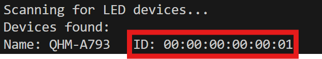

# Praximedes
Elevate your vibe with seamless control over

- 💡 LED lights (HappyLighting) 
- 🎧 Sync music playback (Spotify)
- 🗣️ Intuituve voice commands 

All of the above, in Python! 

## 🚀 Getting Started:
1. **Clone repository**
   <br>Clone this repository
```bash
git clone https://github.com/tapiaer22/Praximedes.git
```
<br>

2. **Install dependencies**
   <br>Go to `Praximedes` folder and install the necessary packages:
```bash
cd ./Praximedes
pip install -r requirements.txt
```
<br>

3. **Configure settings**
   <br>If you do not know the MAC address of your device, you can copy this to scan for nearby led devices
   
```bash
python .\src\main.py -a "scan for led devices"
```

<br>You will get a list of devices with name and ID (MAC address):

<br>

   <br>Just copy the ID and replace it with `ID of Mac address`, and you can put any name you like for `Any name here`. Then run the following command
```bash
python .\src\main.py -m "ID of Mac address" -n "Any name here"
```
   <br>The following is an example with ID: `00:00:00:00:00:01` and name: `My Room`
```bash
python .\src\main.py -m "00:00:00:00:00:01" -n "My Room"
```
   
<br>

6. **Run the project**
   <br> Run `main.py`
```bash
python .\src\main.py
```
<br>

After proper setup, you can run commands with your voice! Say "turn on led lights", "turn off led lights", "change color to blue".
> Note: In order to execute commands, you will need to say the wake word so that it starts listening to your commands.
> <br>You can now say commands until you terminate the program.

<br>

7. **Terminate program**
   <br>To terminate the program, press `Ctrl + C` on the terminal/command line. Alternatively, you can say the wake word and then say `stop listening` 

<br><br><br><br><br>


## 📜 List of commands
Once you run `main.py`, you could try saying these commands for the program to execute:

💡LED
- `turn off lights`: will turn off the LED lights.
- `turn on lights`: will turn on the LED lights.
- `change color to [color]`: will change color of LED lights to the [color] you specify ([list of colors here](./config/colors.json)).
- `scan for led devices`: scans for LED devices that are nearby.
  
🎧Spotify
- `my spotify playlists`: shows your available spotify playlists.
- `spotify devices`: shows a list of devices with spotify that are currently available to play music.
- `play [song] by [artist]`: plays a [song] that you say, and you could be more specific by mentioning the [artist].

🛠️Special commands
- `they not like us`: will play 'they not like us' by Kendrick Lamar and sing a part of the chorus.
- `turn on chill mode`: will set LED lights to a chill environment, play a chill playlist, and make the PC speak with a chill tone 🤙🏾🤙🏾🤙🏾

<br><br>You can also run commands from the terminal/command line:
```bash
python .\src\main.py -a "command here"
```
<br>Examples:
```bash
python .\src\main.py -a "turn off led lights"
```
```bash
python .\src\main.py -a "change color to red"
```
<br><br><br><br><br>


## Wiki and Documentation

### [LED_Source.py](https://github.com/tapiaer22/Praximedes/wiki/LED_Source.py)

### [Spotify_Controller.py](https://github.com/tapiaer22/Praximedes/wiki/Spotify_Controller.py)

### [Praximedes.py](https://github.com/tapiaer22/Praximedes/wiki/Praximedes.py)
