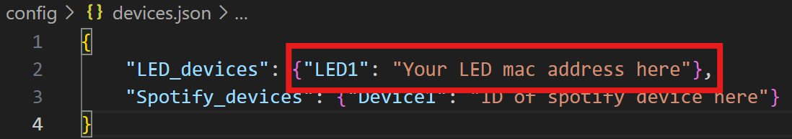

# Praximedes
Elevate your vibe with seamless control over

- 💡 LED lights (HappyLighting) 
- 🎧 Synced music playback (Spotify)
- 🗣️ Intuituve voice commands 

All of the above, in Python! 

## 🚀 Getting Started:
1. **Clone repository**
```bash
git clone https://github.com/tapiaer22/Praximedes.git
```
<br>

2. **Install dependencies**
   <br>Go to project folder and install the necessary packages:
```bash
pip install -r requirements.txt
```
<br>

3. **Configure settings**
   <br>Input the MAC address of your HappyLighting LED device into "Your LED mac address here" at `/config/devices.json`.
   
   <br>
   > Note: a MAC address looks like this: `00:00:00:00:00:00`. If you do not know the MAC address        of your device, run `main.py` and say "scan for led devices". This will output the available        LED devices nearby you.
<br>

5. **Run the project**
   <br> Run `main.py`
```bash
python main.py
```
<br>

After proper setup, you can run `main.py` and say commands like "turn on led lights", "turn off led lights", "change color to blue".
> Note: You can only say 1 command per run. So, if you want to execute another command, you will have to run `main.py` again.

<br><br><br><br>


## [LED_Source.py](https://github.com/tapiaer22/Praximedes/blob/main/src/LED_Source.py) (Happy Lighting) 
Easily light up your space with `LED_Source`! 💡✨

This module contains the class `LED_Source` that could be used to manipulate LED lights from Happy Lighting by using python code. All methods are async and awaitable, 

### Initialization:
```python
led = LED_Source(device_address, logs=True)  #  Initialize class (with logs by default)
```
Parameters:
- `device_address`: the MAC address of the BLE device (required)
- `logs`: output logs and messages to a file (optional)
<br>

### Methods:
- `connect()`
  <br>After initializing the class, you must use the `async connect()` method to start a BLE connection
```python
led = LED_Source("00:00:00:00:00:00")  #  Initialize class (with logs by default)
await led.connect()  # Connect to 00:00:00:00:00:00
```
<br>

- `disconnect()`
  <br>Assuming you had a connection with the BLE device, you can manually disconnect from it
```python
await led.disconnect()  # Manually disconnect from current BLE device
```
<br>

- `change_power(state="ON")`
  <br>Turn on LED lights with parameter state="ON", or turn off LED lights with state="OFF"
```python
await led.change_power(state="ON")    # Turrn on LED lights
await led.change_power(state="OFF")   # Turn off LED lights
await led.change_power()  # Turns on LED lights by default
```
<br>
  
- `scan_devices()`
  <br>Scans for nearby LED devices from Happy Lighting, printing their name and MAC address 
```python
await led.scan_devices()  # Scan for Happy Lighting LED devices
# Output:
# Devices found:
# Name: QHM-LED0  ID: 00:00:00:00:00:00
# Name: QHM-LED1  ID: 00:00:00:00:00:01
```
<br>
  
- `change_color(R,G,B)`
  <br>Changes the color of LED lights using RGB values
  Parameters:
  - `R`: red component of color (int between 0 and 255)
  - `G`: green component of color (int between 0 and 255)
  - `B`: blue component of color (int between 0 and 255)
```python
await led.change_color(255,0,0)  # Change color to RED
await led.change_color(128,0,128)  # Change color to PURPLE
await led.change_color(0,255,0)  # Change color to GREEN
```
<br>
  
- `change_mode(idx)`
  <br>Changes mode of LED lights. There are 23 modes, so idx stands for the index of the known modes. idx is an int between 0 - 22 (inclusive), and the modes could be found in the module [here](https://github.com/tapiaer22/Praximedes/blob/main/src/LED_Source.py)
```python
await led.change_mode(0)  # Pulsating rainbow
await led.change_mode(1)  # Pulsating red
await led.change_mode(9)  # Pulsating red/blue
```
<br>
  
- `ChillMode()`
  <br>Customized chill feature made by the developer. Sets the LED lights to a chill color and customized settings for a chill environment
```python
await led.ChillMode()  # Set LED to a chill environment
```
<br>

### Examples
A simple scenario to turn on lights, change color to red, and disconnect from the device
```python
import asyncio
# Put class LED_Source with dependencies here, or import it

async def yeah():
    led = LED_Source("MAC address here")    #Initialize LED source
    await led.connect()     # Connect to device
    await led.change_power()    # Turn on device
    await led.change_color(255,0,0)     # Change LED light color to Red
    await led.disconnect()  # Disconnect from device (optional)

asyncio.run(yeah())     # Run async function
```

A scenario to turn on lights and change to mode Pulsating green/blue
```python
import asyncio
# Put class LED_Source with dependencies here, or import it

async def green_blue():
    led = LED_Source("MAC address here")    #Initialize LED source
    await led.connect()     # Connect to device
    await led.change_power()    # Turn on LED lights
    await led.change_mode(10)    # Change mode to Pulsating green/blue

asyncio.run(green_blue())     # Run async function
```

A scenario to engage in chill mode
```python
import asyncio
# Put class LED_Source with dependencies here, or import it

async def set_chill():
    led = LED_Source("MAC address here")    #Initialize LED source
    await led.connect()     # Connect to device
    await led.ChillMode()   # set LED lights to a chill environment

asyncio.run(set_chill())     # Run async function
```
<br><br>


## [Spotify_Controller.py](https://github.com/tapiaer22/Praximedes/blob/main/src/Spotify_Controller.py)
This module connects with the Spotify API.

### Initialization

### Methods

### Examples

<br><br>


## [Praximedes.py](https://github.com/tapiaer22/Praximedes/blob/main/src/Praximedes.py)
This module contains the voice assistant code. It is meant to combine [LED_Source.py](https://github.com/tapiaer22/Praximedes/blob/main/src/LED_source.py) and [Spotify_Controller.py](https://github.com/tapiaer22/Praximedes/blob/main/src/Spotify_Controller.py) to perform customized actions while speaking.

### Initialization
```python
prax = Praximedes(logs=True, print_speech=True, confirmation_message="Hell yeah boss...")   # Initializae class with default settings
```
Parameters:
- `logs`: output logs on a file (optional)
- `print_speech`: print what is being spoken by the PC to the console (optional)
- `confirmation_message`: message for PC to say after executing a method. You can personalize this (optional)

### Methods
- `speak(message)`
  <br>A message for the PC to say
```python 
prax = Praximedes()   # Initialize class
prax.speak("Hello World!") # PC will say "Hello World!"
```
<br>

- `confirm_command_message(command)`
  <br>This is a decorator that is not meant to be used outside the class. It is a wrapper that says the `confirmation_message` when executing a method within the class. It should be used if you want to add more methods to the class and you want a message to be said when calling it.
```python
class Praximedes:
   __init__(...)
   ...
   #Your customized function
   @confirm_command_message
   def welcome_user(self):
      self.speak("Hi, new user! Welcome back!")
```
<br>

- `set_voice_settings(voice,rate,volume)`
  <br> This are the voice setting for the PC.

   Parameteres:
  - `voice`: could be 'male' or 'female'. Default is 'female'. (optional)
  - `rate`: rate of speech at 'words per minute', within 60-300 words per minute inclusive. Default is 180. (optional)
  - `volume`: volume of PC when speaking, between 0 - 1.0: `0` being mute and `1.0` being the loudest. Default is `1.0`. (optional)
```python
prax.set_voice_settings('male',120,0.5)     # Change voice to male, at 120 wpm, and volume at 50%
prax.speak("This is a new voice setting")   # Will speak with new voice settings
```
<br>

- `transcribe_action(language='en')`
  <br>This function captures audio from the microphone and returns a transcription of what was said. It uses the specified language for transcription; in this case, it will listen in english: `'en'`
  
  Parameters:
  - `language`: the language for transcription. (optional)
  
  Returns:
  -  `query`: A string of the transcribed text of the audio captured
```python
# Transcribe message in English
transcription_en = prax.transcribe_action()
print(transcription_en)

# Transcribe message in Spanish
transcription_es = prax.transcribe_action('es')
print(transcription_es)
```
<br>
  

### Examples

<br><br>


## main.py
